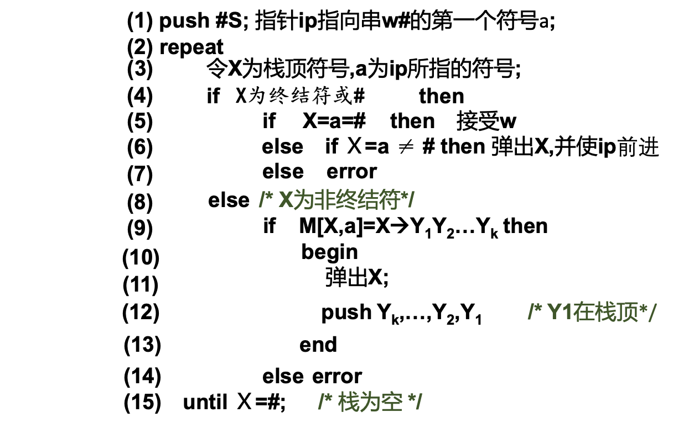

# Simple Compiler

## Lexical Analysis 词法分析器

### 算法描述

词法分析器由 Java 实现。

首先定义 `KEYWORDS` 列表存储关键字、定义 `OP` 列表存储运算符、定义 `SE` 列表存储界符，最后定义 `SINGLE_OP` 存储单字符运算符和双字符运算符的两个单独字符，用于后续判断。

其次定义三个列表：`analyzed` 用于存放已经读入的源程序字符、`analyzing` 用于存放等待读入的所有字符、`tokensResult` 用于存放分析后的 token 序列。

最后定义 `tableResult` map 存储符号表。

整体流程：读入源程序并存储为字符串，末尾增加 `'\n'` 用于判断源程序结束，转换为字符列表并存储到定义的 `analyzing` 中；初始化上述定义的其他列表和 map，最后进行主要算法。

算法使用 DFA 实现。

初始状态为 0，循环读入 `analyzing` 中的字符存储到 `analyzed` 中，对 `analyzed` 中的字符组成的字符串进行判断并识别，当 `analyzing` 为空时结束。定义一系列 io 方法：

- `doCheck`：将 `analyzing` 的第一个字符读入到 `analyzed` 中，并在 `analyzing` 中删除，返回这个字符；
- `skipCheck`：遇到了空格、制表符、换行符等无需识别的字符，跳过即可，即清除当前 `analyzed` 列表；
- `undoCheck`：从 `analyzing` 中多读入了一个字符到 `analyzed` 中，需要从 `analyzed` 中退还给 `analyzing`；
- `finishCheck`：此时 `analyzed` 中的字符组成的字符串成功识别为 token，传入参数为其类型。当类型为 `IDN`、`CONST`、`CHAR` 和 `STR` 时，定义其值为 token 本身；其他类型定义其值为 `_`。最后加入到 `tableResult` 中。

状态编号定义及转换：

- 0：初始状态，根据读入的字符进行状态转换，若都无法匹配则输出“无法识别该符号”。
- 1：识别出一个字母，可能是关键字或标识符，需要进一步判断：如果下一个读入的字符是字母、数字或下划线，则循环状态 1；如果是其他字符说明此 token 识别结束，转移到状态 5，并撤销读入。
- 2：识别出一个数字，可能是整数或浮点数，需要进一步判断：如果下一个读入的字符是数字，则循环状态 2；如果是 `.` 说明是浮点数，转移到状态 6；如果是其他字符说明此 token 为整数，转移到状态 7，并撤销读入。
- 3：识别出一个运算符，可能是单字符运算符或双字符运算符，需要进一步判断：再读入一个字符，如果 `SINGLE_OP` 中不存在此运算符，则说明不是双字符运算符，撤销读入。将运算符转换为字符串，判断是否存在 `OP` 中，若不存在则撤销第二个字符。最后识别成功，转移到状态 9。
- 4：界符识别成功。
- 5：由状态 1 而来，只需判断是关键字还是标识符：如果存在 `KEYWORDS` 中，则关键字识别成功，否则是标识符，转移到状态 8。
- 6：由状态 2 而来，说明是浮点数，如果再次读入的是数字，则循环状态 6，否则转移到状态 7。
- 7：整数和浮点数识别成功。
- 8：标识符识别成功。
- 9：运算符识别成功。
- 10：已经读入一个 `'`，直到下一次读入 `'` 之前循环状态 10，否则转移到状态 12。
- 11：已经读入一个 `"`，直到下一次读入 `"` 之前循环状态 11，否则转移到状态 13。
- 12：字符识别成功。
- 13：字符串识别成功。
- 其他：不可到达的状态。

最后定义 `printResult` 暴露给外部接口，打印 token 序列和符号表。

### 输出格式说明

1. token 序列：最外层由 `[ ` 和  `]` 包裹，内部各 token 间以一个半角逗号 `,` 和一个空格 ` ` 作为间隔，如下所示。

	```shell
	[token1, token2, token3, ..., tokenN]
	```

2. 符号表：每一个 token 在一行，每行首先是 token，然后是一个制表符 `\t`，然后是 `<` 和 `>` 包裹的类型（大写）、一个半角逗号 `,` 和值（中间没有空格），如下所示。

	```shell
	token1	<TYPE,value>
	token2	<TYPE,value>
	...
	tokenN	<TYPE,value>
	```

### 源程序编译步骤

下载“源代码”压缩包并解压，终端打开当前目录，`ls` 显示为：

```shell
❯ ls
src  test
```

其中 `test` 目录为测试文件存放处，`src` 目录为源程序。

首先将测试文件拷贝到 `test` 目录，其次在 `src/Main.java` 中修改第 8 行第 71 列开始的文件名为测试文件名（下方的 `test1.c` 即为测试文件名）：

```java
package src;

/**
 * @author super
 */
public class Main {
    public static void main(String[] argc) {
        LexicalAnalysis lexicalAnalysis = new LexicalAnalysis("./test/test1.c");
        lexicalAnalysis.printResult();
    }
}
```

编译：

```shell
❯ javac src/LexicalAnalysis.java src/Main.java
```

运行：

```shell
❯ java src.Main
```

得到类似输出即成功：

```shell
# token 序列
[void, main, (, ), {, int, i, =, 2, ;, while, (, i, <=, 4, ), {, i, =, i, +, 1, ;, }, }]

# 符号表
void	<VOID,_>
main	<IDN,main>
(	<SE,_>
)	<SE,_>
{	<SE,_>
int	<INT,_>
i	<IDN,i>
=	<OP,_>
2	<CONST,2>
;	<SE,_>
while	<WHILE,_>
(	<SE,_>
i	<IDN,i>
<=	<OP,_>
4	<CONST,4>
)	<SE,_>
{	<SE,_>
i	<IDN,i>
=	<OP,_>
i	<IDN,i>
+	<OP,_>
1	<CONST,1>
;	<SE,_>
}	<SE,_>
}	<SE,_>
```

> 注意：修改 `src` 中文件后需要重新编译再运行；修改 `test` 中文件后无需重新编译，直接运行即可。

## Syntax Analysis 语法分析器

### 算法描述

语法分析器由 Java 实现。

整体步骤为：

- 读取文件，解析得到语法规则
- 根据语法规则得到 FIRST 集合
- 根据语法规则和 FIRST 集合得到 FOLLOW 集合
- 根据语法规则、FIRST 集合和 FOLLOW 集合得到预测分析表
- 根据预测分析表、词法分析器得到的 token 序列和起始符号得到规约序列

首先定义了``TERMINAL_SYMBOLS``存储终结符、``syntax``存储语法规则、``notTerminalSymbols``存储非终结符、``firstSet``存储First集、``followSet``存储Follow集。

通过文件读取所有的语法规则，并通过``getFirstSet``和``getFollowSet``计算得到First集和Follow集。

#### readSyntax

以``Map<String, List<String[]>>``存储产生式的左侧和右侧的所有元素，并将左侧的元素添加进非终结符的集合中。

#### getFirstSet

对于每个产生式，判断其右侧的第一个符号是否为终结符：

- 若是终结符，则加入First集合

- 若不是，则依次判断这个串前若干个非终结符的First集是否有空，直到遇见终结符
	- 是非终结符，继续判断其 first 集合是否有空
		- 是非终结符，且 first 集有空，把 first 集非空元素加入，继续循环
		- 是非终结符，且 first 集不含空，把 first 集元素加入，停止循环
	- 是终结符，停止循环

#### getFollowSet

对于每个产生式，判断其右侧的每一个非终结符元素：

- 没到结尾，是非终结符
	- 下一个还是非终结符，遍历它的 first
		- 把非空的加到 follow 里
		- 下一个是最后一个，而且有空，添加``FOLLOW(left)``至``FOLLOW(right)``中
	- 下一个是终结符，加入到 follow 集中
- 到结尾且是非终结符，添加``FOLLOW(left)``至``FOLLOW(right)``中

#### getPredictTable

使用 List 到 String 的映射存储，即非终结符和终结符确定一个规约规则。

对文法的每个产生式 A -> alpha，执行以下两步：

- 对每个终结符 a 属于 alpha 的 FIRST 集，把 A -> alpha 加入到 M[A, a] 中
- 若 alpha 的 FIRST 集有空，则对任何 FOLLOW(A) 中的 b，把 A -> \$ 加入到 M[A, b] 中

把所有无定义的 M[A, a] 标上出错标志 error。

#### predict

整体思路如下：



### 输出格式说明

 1. First 集与 Follow 集

	```shell
	FIRST:
	S: int char float void IDN
	
	FOLLOW:
	S: #
	```

 2. 预测分析表（非终结符位宽 18，其他位宽 60）

	```
	     while      for continue    break
	S    error    error    error    error
	```

 3. 规约序列：（序号）栈顶符号-面临输入符号（执行动作）【十个空格】栈顶到栈底符号串【十个空格】 选用规则

	```shell
	（1）S-int          S          S -> func
	```


### 源程序编译步骤

下载“源代码”压缩包并解压，终端打开当前目录，`ls` 显示为：

```shell
❯ ls
src  test
```

其中 `test` 目录为测试文件存放处，`src` 目录为源程序。

首先将测试文件拷贝到 `test` 目录，其次在 `src/Main.java` 中修改第 8 行第 71 列开始的文件名为测试文件名（下方的 `test1.c` 即为测试文件名）：

```java
/**
 * @author super
 */
public class Main {
    public static void main(String[] argc) {
        LexicalAnalysis lexicalAnalysis = new LexicalAnalysis("./test/test1.c");
        lexicalAnalysis.printResult();
        SyntaxAnalysis syntaxAnalysis = new SyntaxAnalysis("./src/syntax.txt", lexicalAnalysis.getTokensResult());
        System.out.println("# FIRST 集合");
        syntaxAnalysis.printFirst();
        System.out.println("# FOLLOW 集合");
        syntaxAnalysis.printFollow();
        System.out.println("# 预测分析表");
        syntaxAnalysis.printTable();
        System.out.println("# 规约序列");
        syntaxAnalysis.printPredict("S");
    }
}
```

编译：

```shell
❯ javac src/LexicalAnalysis.java src/SyntaxAnalysis.java src/Main.java
```

运行：

```shell
❯ java src.Main
```

得到类似输出即成功：

```shell
# token 序列
[void, IDN, (, ), {, int, IDN, =, INT, ;, while, (, IDN, <=, INT, ), {, IDN, =, IDN, +, INT, ;, }, }]

# 符号表
void	<VOID,_>
main	<IDN,main>
(	<SE,_>
)	<SE,_>
{	<SE,_>
int	<INT,_>
i	<IDN,i>
=	<OP,_>
2	<CONST,2>
;	<SE,_>
while	<WHILE,_>
(	<SE,_>
i	<IDN,i>
<=	<OP,_>
4	<CONST,4>
)	<SE,_>
{	<SE,_>
i	<IDN,i>
=	<OP,_>
i	<IDN,i>
+	<OP,_>
1	<CONST,1>
;	<SE,_>
}	<SE,_>
}	<SE,_>
# FIRST 集合
FIRST:
S: int char float void IDN
func: int char float void IDN
type: int char float void $
args: int char float void IDN $
arg: , $

...（此处省略若干行）

（80）INT-INT（跳过）          INT item' value' ; stmts } stmts }
（81）item'-;          item' value' ; stmts } stmts }          item' -> $
（82）value'-;          value' ; stmts } stmts }          value' -> $
（83）;-;（跳过）          ; stmts } stmts }
（84）stmts-}          stmts } stmts }          stmts -> $
（85）}-}（跳过）          } stmts }
（86）stmts-}          stmts }          stmts -> $
（87）}-}（跳过）          }
accept!
```

> 注意：修改 `src` 中文件后需要重新编译再运行；修改 `test` 中文件后无需重新编译，直接运行即可。
